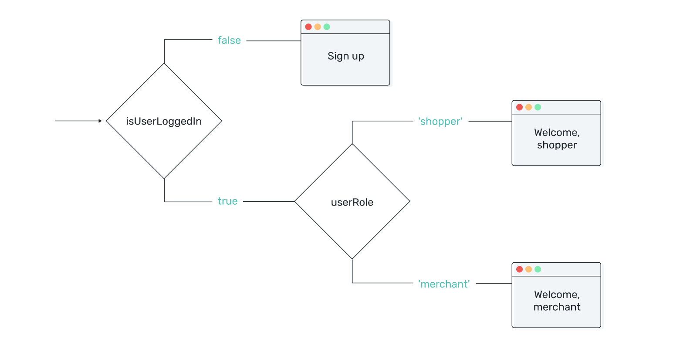
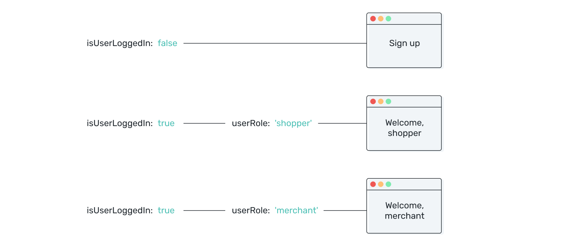
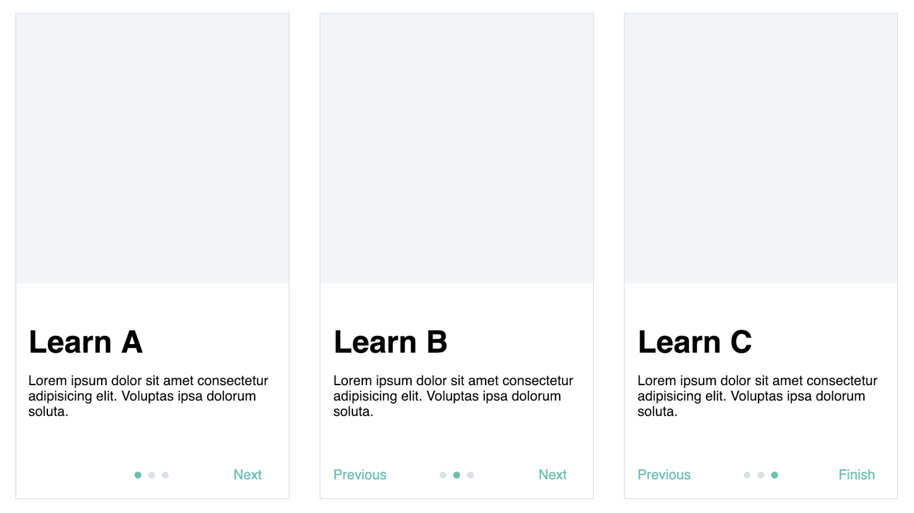

# Complex conditions

## Multiple conditions — AND

Let's say your prototype has two kinds of welcome screens — each for a role a user choose when signing up:


<!-- todo: replace with screenshots from actual implementation -->

Here's how a diagram of the flow looks like:



You can follow this by creating two variables for conditions and implementing two layers of conditional containers: first, to check wheteher is logged in, then if the user is, check for role:

```vue
<div v-if="!isUserLoggedIn">
  Sign up screen
</div>
<div v-if="isUserLoggedIn">
  <div v-if="userRole === 'shopper'">
    Welcome, shopper
  </div>
  <div v-if="userRole === 'merchant'">
    Welcome, merchant
  </div>
</div>
```
<!-- ```js
data: {
  isUserLoggedIn: false,
  userRole: 'shopper'
}
``` -->

This works but you can avoid nesting containers by combining conditions. If you turn the flowchart into a flat list of conditions for each screen:



In our example you need to check whether two conditions are satisfied for welcome screens, use AND written as &&:

```html
<div v-if="isUserLoggedIn">
  Sign up screen
</div>
<div v-if="isUserLoggedIn && userRole === 'shopper'">
  Welcome, shopper
</div>
<div v-if="isUserLoggedIn && userRole === 'merchant'">
  Welcome, merchant
</div>
```
#### 👐 Hands-on

1. Download the [sample file](./../../../course-files/interaction-basics/conditionals-equality-1.html.zip) and open it in Chrome.
2. Use radio buttons on Sign up screen to switch roles. See value changing in dev tools.
3. Switch authentication state between `true` and `false` in Vue dev tools to see different welcome screens.

<video width="100%" controls loop autoplay muted>
<source src="./images/conditions-complex-1.mp4" type="video/mp4">
</video>


<!-- First, you need a variable to store the state of user's authentication:

```js
data: {
  isUserLoggedIn: false
}
```

Now you can create conditions to show Sign up screen when users are not logged in, and show Welcome screen when they are:

```html
<div v-if="!isUserLoggedIn">
  Sign up screen
</div>
<div v-if="isUserLoggedIn">
  Welcome, shopper
</div>
<div v-if="isUserLoggedIn">
  Welcome, merchant
</div>
```

The problem you face now is that both welcome screens will be shown for a logged in user. To fix that you need a variable to store the role of a user:

```js
data: {
  isUserLoggedIn: false,
  userRole: 'shopper'
}
```

...As you've learnt from [equality](equality.md)... The condition to show shopper's welcome screen is `role === 'shopper'` and merchant's is `role === 'merchant'`. To combine these conditions with the authentication one you need **AND** operator writen as **&&**:

```vue
<div v-if="isUserLoggedIn">
  Sign up screen
</div>
<div v-if="isUserLoggedIn && userRole === 'shopper'">
  Welcome, shopper
</div>
<div v-if="isUserLoggedIn && userRole === 'merchant'">
  Welcome, merchant
</div>
```

The condition for the shopper, for example, can be read as “show the container only if `isUserLoggedIn` is true AND `userRole` is 'shopper'”. This way users will see only one welcome screen based on their choice of role. -->

## Either of conditions — OR

Let's say you need to go one step further and add a screen shows when a user logs in for the first time, or if the full name is empty:



Tasks like this require you to check for two conditions, but you need only one to be true, not both. To perform this type of check you use **OR** operator written as **||**:

```html
<div v-if="isFirstLogin || userFullname === ''">
</div>
```

This condition can be read as “show the container if `something` is true OR if `somethingElse` equals to 0”. Now when either of those conditions is satisfied, the container will be rendered.  

#### 👐 Hands-on

Open the [file]()

> video

## Combining conditions

Case: 

> UI


```html
<div v-if="userRole === 'admin' || (userRole === 'user' && doesUserHaveAccess)">
</div>
```

## 👶 Self-practice: basic