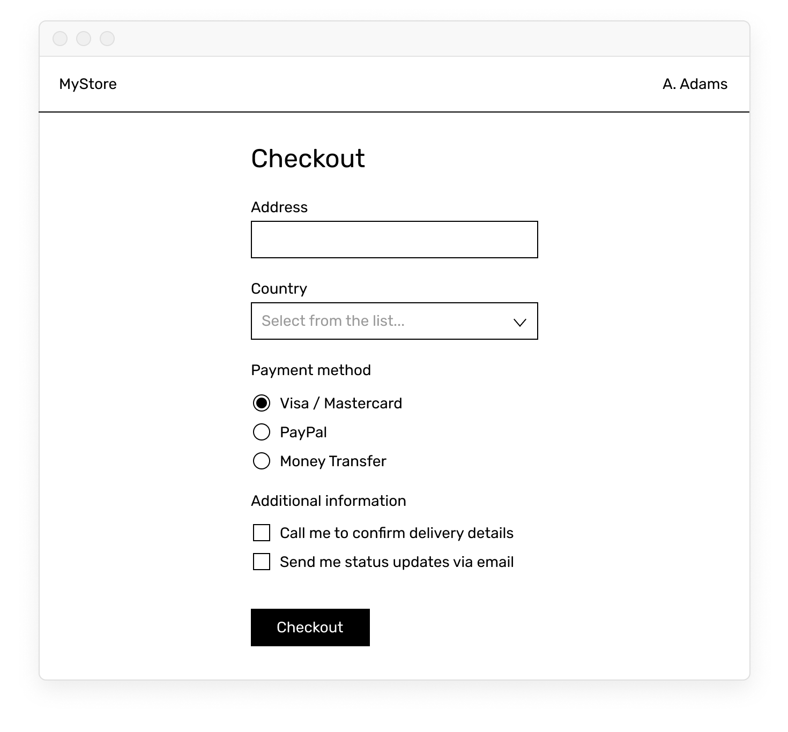

# Connecting data

## Displaying in containers


Once the data is stored in a variable, you can display its value in your layout:

<!-- todo: add screenshot of the UI to connect with the result  -->
```html
<div>{{itemsInCart}}</div>
```
```js
data: {
  itemsInCart: 2
}
```
- The two pairs of curly braces is your way to indicate that *itemsInCart* is a variable and you want to display its value inside a container.

## Connecting to form inputs

As mentioned previously, variables are commonly used to save information inputed by users. Below are the basic form input controls and the ways you can connect them to your data storage. 

### Text

There’s an attribute in Vue that allows to bind a form control with a variable: `v-model`. It’s placed inside a control and is followed by the name of the variable you want to connect. Now everything a user types into the input will be stored in specified variable. 

```html
<input v-model="userEmail"> 
```
```js
data: {
  userEmail: 'support@mockupless.com'
}
```
- Inputs of types *email* and *password* are connected the same way
- Pro note. By binding a control and a variable, you connect them both ways. If the variable is changed, the value of control is changed


### Checkbox

Value of a checkbox is always binary: it’s either on or off, so it makes sense to connect it to a variable with a Boolean value. Clicking on a checkbox input toggles the variable’s value between true and false.

<!-- todo: add screenshot of the UI to connect with the result  -->
```html
<input type="checkbox" v-model="didAgreeToPolicy"> I agree with Privacy Policy
```
```js
data: {
  didAgreeToPrivacyPolicy: false
}
```

### Radio buttons

A set of radio button controls should be connected to a single variable to control which one is currently selected. So each input from a group should have the same variable name in its v-model attribute.

Radio buttons require another attribute: **value**. In it you specify what should be stored in a variable when the radio button is selected. 

<!-- todo: add screenshot of the UI to connect with the result  -->
```html
<div>
  <input type="radio" v-model="emailsDaily" value="One"> Just one
</div>
<div>
  <input type="radio" v-model="emailsDaily" value="Two"> Twice a day
</div>
<div>
  <input type="radio" v-model="emailsDaily" value="Three"> All three
</div>
```
```js
data: {
  emailsDaily: 'One'
}
```
- The value of a radio button doesn’t have to be the same as its label, but it’s easier to keep track of them when they are the same

### Dropdown / Select

To connect a dropdown to your data you need to add v-model to ‘select’ control. The value inside the selected ‘option’ container will be stored in your data.

<!-- todo: add screenshot of the UI to connect with the result  -->
```html
<select v-model="plan">
  <option>Free</option>
  <option>Pro</option>
  <option>Business</option>
</select>
```
```js
data: {
  plan: 'Free'
}
```

- Similarly to radio buttons, you can specify ‘value’ for each option if you want it to be different from the actual content between ‘option’ tags. As with radio buttons, it’s recommended to have them the same. 

## Self-practice

### Task #1

1. [Download](https://firebasestorage.googleapis.com/v0/b/mockupless.appspot.com/o/self-practice%2Fdata%2Fsignup.html.zip?alt=media&token=26cc5f40-aa94-4328-80e4-786676bd382d) the template which already includes the layout:


2. Come up with the name of the app, save it as a [variable](./variables.html#variables) and [display](./display.html#displaying-in-containers) it in the title after “Welcome to”

3. Create a variable for each form input and [connect](./display.html#connecting-to-form-inputs) all variables to inputs in your html

4. Make sure everything works properly. Open [Vue devtools](./../Setup/devtools.html), click on `<Root>` in the upper panel, and see if data you input in your form appears in the lower panel next to the appropriate variables:


### Task #2

1. Start from the blank prototyping [template](./../Setup/template.html)
2. Create a layout similar to the shown but with your own styles:



2. Store username as a [variable](./variables.html#variables) and [display](./display.html#displaying-in-containers) it in the layout
3. Create a variable for each form input and [connect](./display.html#connecting-to-form-inputs) all variables to inputs in your html. Good luck with [radio buttons](./display.html#radio-buttons) 😉
4. Make sure everything works properly using [Vue devtools](./../Setup/devtools.html)