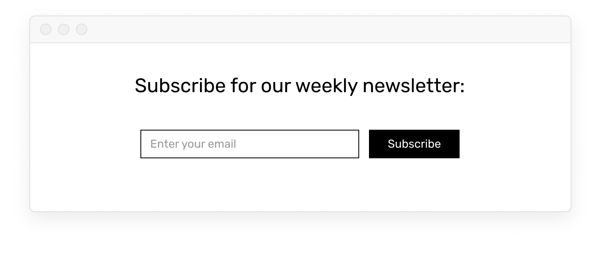

# Other events

## Focus and unfocus

<!-- todo: video example -->

Click is not the only type of interaction you might expect from a user. When designing a form or a search bar, for example, you may want to know when the input field was focused and when it lost its focus to change styles, show and hide elements, etc. You can do that with `@focus` and `@blur`(unfocus) event listeners:

```vue
<input @focus="doShowEmailHelp = true" @blur="doShowEmailHelp = false" placeholder="Enter your email...">
<div v-if="doShowEmailHelp">Make sure you input your work email</div>
```

The code above will make the help text container visible when the input is focused, and hide the container when the focus is lost. This is achieved with applying different values to `doShowEmailHelp` variable based on `@focus` and `@blur` events, and making the div a conditional container based on the value of the same variable.

## Hover

<!-- todo: video example -->

Another common interaction on desktop is hovering over elements with mouse cursor. Similarly to how focus is tracked, you need to add two event listeners: `@mouseover` will execute your instructions when the cursor appears over the element, and `@mouseleave` will fire when the cursor leaves the area of the element:

```vue
<div @mouseover="doShowArrow = true" @mouseleave="doShowArrow = false">
  <span>All discussions</span>
  <span v-if="doShowArrow">→</span>
</div>
```

Hovering the container will assign `true` to `doShowArrow` thanks to `@mouseover` event, and the second - conditional - `<span>` will appear. `@mouseleave` turns value back to `false` so the second `<span>` is hidden when not hovered.

## Key press (enter)

<!-- todo: proper intro -->

You already know how you can [connect input](./../Data/display.md#text) to a variable with `v-model`, so whatever a user puts into it is saved and can be accessed later. You don't need to listen and react to every press of a key to achieve that. However, there are special keys you might want to track.

For example, if you are prototyping a search bar, users will probably expect that they can just hit return/enter instead of clicking Search button. This interaction can be tracked with `@keypress` event and `.enter` modifier which specifies the key you want to listen to being pressed:

```vue
<input v-model="userEmail" @keypress.enter="doShowSearchResults = true">
<button @click="doShowSearchResults = true">Search</button>
```

In this example you see how `@click` event listener attached to a button is changing the value of `doShowSearchResults` variable. Since you want the exact same instructions to happen when user presses return/enter inside search input, you provide the same instructions for `@keypress.enter` event attached to the input.

Other modifiers include `.tab`, `.esc` and [a couple of others](https://vuejs.org/v2/guide/events.html#Key-Modifiers).


## Self-practice

#### Task

Create a prototype of search input field with multiple interactive features:

<video width="100%" controls loop autoplay muted style="margin-top: 0px; margin-bottom: 24px;">
  <source src="./media/search-task-demo.mp4" type="video/mp4">
</video>

- when focused, the suggestions box is shown;
- if the search input is empty, the message is shown in the suggestion box: “Start inputing query to see results”;
- if the search input is not empty, the suggestions are shown;
- if the search input is not empty, the clear (x) button is shown;
- pressing return/enter hides suggestions box;
- clicking clear (x) button clears input and hides suggestions box;
- clicking on a suggestion puts the suggestion into input and hides suggestions box.

Download the [starting layout](./../../../course-files/interaction-basics/events-other-task-1-start.html.zip) or feel free to create your own.

#### Solution

If you have any problems completing the task, dowload and review the [complete prototype](./../../../course-files/interaction-basics/events-other-task-1-end.html.zip)

<!-- ### Search results

Add appropriate variables and events to the template to display users' input and clear the input field when they press Enter/Return:


1. Download the [template](https://firebasestorage.googleapis.com/v0/b/mockupless.appspot.com/o/self-practice%2Fdata%2Fsearch-results.html.zip?alt=media&token=c5166645-7005-456a-a9b1-e30d7957cd63) with the built-in layout.
2. Create a variable and [connect](./../Data/display.md#connecting-to-form-inputs) it to the search input field.
3. Create another variable and [display](./../Data/display.html#displaying-in-containers) it after “Search results for ”
4. Add a [keypress.enter](./other.md#keypress) event to the input field that adds search query to the title and clears the input field. Separate your operations within one event with a semicolon, e.g. `sum = 1 + 1; diff = 4 - 2` -->


<!-- OLD -->


<!-- Let's say you are prototyping a simple subscription form as a part of your interface:



You know what to do: you create a variable and connect it to the input, and you add an event listener to the Subscribe button:

```html
<input v-model="userEmail">
<button @click="subscriber = userEmail">Subscribe</button>
```

Yet chances are high, that when you start testing this interface, you'll learn that some people are used to being able to hit Return on their keyboard instead of clicking a button to submit a form.

To react to users pressing Return when the input field is focused, you need to add `@keypress.enter` event listener to the input field:

```html
<input v-model="userEmail" @keypress.enter="subscriber = userEmail">
<button @click="subscriber = userEmail">Subscribe</button>
```

- If you want the same results as a button click has, you use same instructions you used for @click
- `.enter` is a modifier for `@keypress` event listener. It specifies which particular button press you want to react to. If you remove a modifier `@keypress` will react to all button presses, which is rarely the desired outcome.
- Other modifiers include `.tab` and `.esc` if you want to change the default behaviour of the corresponding buttons for particular input fields. -->