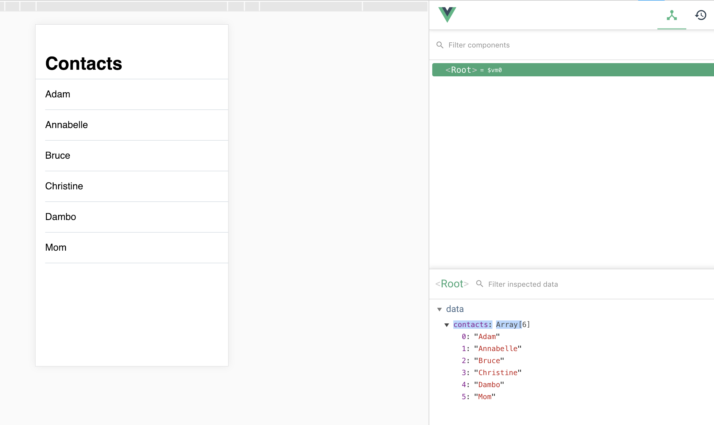
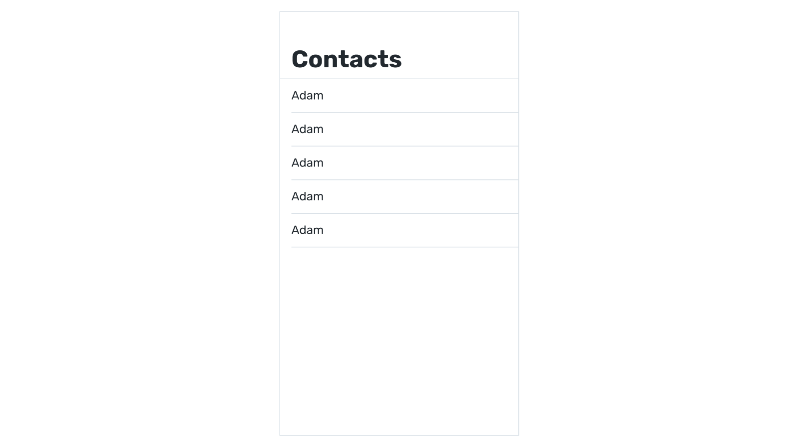

# Lists

often you need to show repetative items: lists, grids, etc. A number of items that have same layout but different content — a component.

> maybe, some UI examples? maybe animated?

let's say your prototype has a list of contacts:


to render it without having to create a container for every single contact, you need two things: a variable that can store lists — it's called an array — and an attribute that turns a container into a repeated component. First thing first.

## Array

You are familiar now with primitive data types: numbers, strings, booleans. An array is a variable that can store a list of values of any kind:

```js
data: {
  contacts: [null, 1, 2, true, 'hello']
}
```

syntax: square brackets, values separated by coma. It's a list of variables that don't have names. Kinda, but will get to that in the next lesson.

for contact's list prototype:

```js
data: {
  contacts: ['Adam', 'Annabelle', 'Bruce', 'Christine', 'Dambo']
}
```

Now let's move on to the layout.

## Loop

first, create a layout for one item:

```html
<div class="border-b border-grey py-4">
  Adam
</div>
```

Now you can repeat this layout for every item in an array. For this you need to add `v-for` attribute and use a value from an array as a content. <!--mention maybe that it's called loop? -->

```html
<div v-for="contact in contacts" class="border-b border-grey py-4">
  {{contact}}
</div>
```

The attribute can be read as “Repeat the container for each value in `contacts` array. For each repetition allow me to access the value by the name of `contact`”. `contact` is a temporary name you give to an item in an array when it's being rendered.

> maybe an animation of how rendering works (see notepad)

#### 👐 Hands-on

download the [sample file](./../../../course-files/interaction-basics/lists-contacts-1.html.zip), add new items to the list, see results.



## 👶 Self-practice: basic

Use template with one letter on the right (like iOS contacts app)
Create an array with all alphabet letters <!--todo: maybe suggest a good way to do this-->
Make the block repeat to show indexes



```js
['a', 'b', 'c', 'd', 'e', 'f', 'g', 'h', 'i', 'j', 'k', 'l', 'm', 'n', 'o', 'p', 'q', 'r', 's', 't', 'u', 'v', 'w', 'x', 'y', 'z']
```

[solution](./../../../course-files/interaction-basics/lists-contacts-2.html.zip)