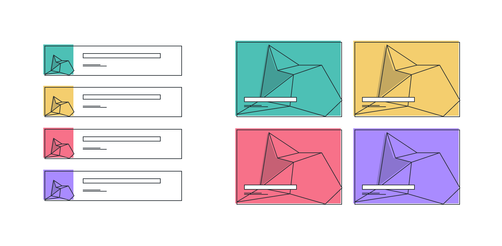
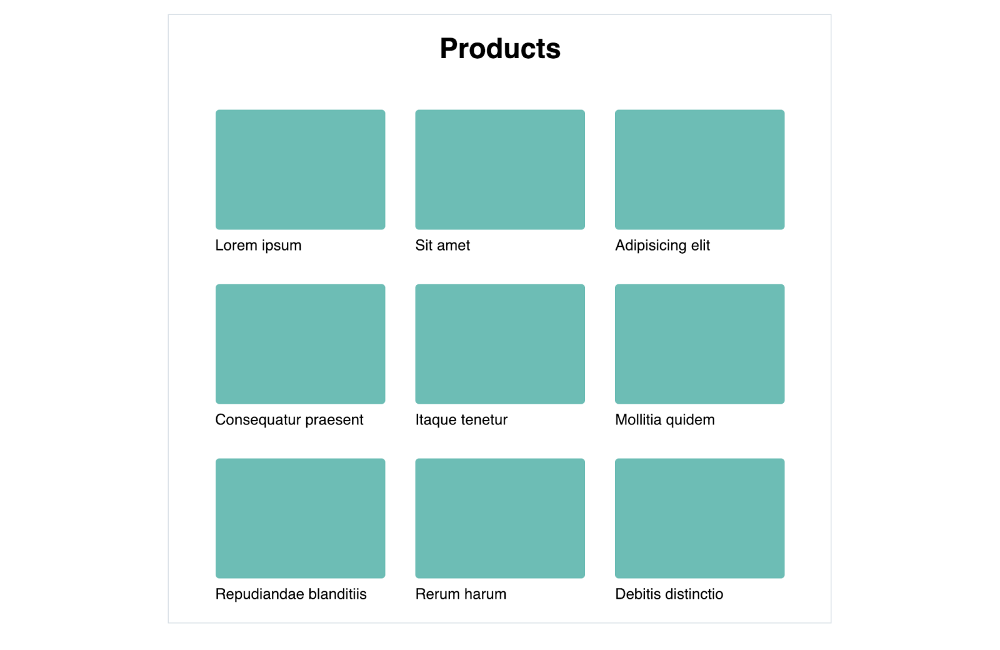

# Lists


<!-- todo: a nice illustration with a list and a grid / maybe real-world examples, but probably no -->

Quite often you need to show repeating components in lists, grids, etc. They should have similar look and behaviour, but the content is probably different. In this chapter you will learn how to generate lists and grids from a single container. As you may have guessed, it's a huge timesaver. 

Let's start with a simple list of contacts:


The most straight-forward way to prototype this is to create a container for every single item with identical styles and populate each one of them with content:

```html
<div class="border-b border-grey-lighter py-4 ml-2">
  Adam
</div>
<div class="border-b border-grey-lighter py-4 ml-2">
  Annabelle
</div>
<div class="border-b border-grey-lighter py-4 ml-2">
  Bruce
</div>
<div class="border-b border-grey-lighter py-4 ml-2">
  Christine
</div>
<div class="border-b border-grey-lighter py-4 ml-2">
  Dambo
</div>
```

The donwside of this approach is pretty obvious — you need to write **a lot of repetative code** and every change of style has to be applied to multiple containers.

Vue provides an alternative way of rendering repeating items that allows to create item layout only once. To achieve this, you will have to do 2 things:

1. Store the content of your list as a special type of variable — **an array**.
2. Add **loop attribute** to a container to render it multiple times.

Let's go through these concepts one by one.

## Array

You are already familiar with [primitive data types](./../Data/README.md): numbers, strings and booleans. Array is the first non-primitive data type introduced in this course, and it is used to store **a list of values of any kind**:

```js
data: {
  contacts: [null, 1, 'hello', true]
}
```

The content of an array is placed within square brackets and its items are separated by commas. Think of an array as a list of variables that don't have names.
<!-- todo: maybe say: Kinda, but will get to that in the next lesson. -->

An array is a perfect fit for items you have to display as a list in the UI. Here's one for the contacts list example:

```js
data: {
  contacts: ['Adam', 'Annabelle', 'Bruce', 'Christine', 'Dambo']
}
```

With contacts stored in a variable, you are ready to create a repeating container. This is where a loop comes into play.


## Loop

First, you create a container for a single item on the list:

```html
<div class="border-b border-grey py-4">
  Adam
</div>
```

Now, instead of manually copying this code many times in your layout, you add `v-for` attribute to the container to create a loop:

```html
<div v-for="item in contacts" class="border-b border-grey py-4">
  Adam
</div>
```

The attribute can be read as “Render the container for each item in `contacts` array”. This basically turns the container into a **template**, which is used to generate so many actual containers as many items the array has.

Here's what you'll see in a browser for the code above: 


You see that the container is shown 5 times, and that's exactly the number of items in the `contacts` array. However all items have the same content — the name you've put inside the container — and this is not the result you expect. This can be fixed easily with another feature `v-for` comes packed with.

As mentioned earlier `v-for="item in contacts"` stands for "render a container for each item in `contacts` array". What's also important is that `item` is a **temporary name** you give to a variable at the time when a container for it is rendered. This means 2 things:
1. You can use almost any word instead of `item`. For example, `v-for="contact in contacts"` works absolutely the same.
2. More importantly, you can use this name in your template-container. This way when, for example, a first copy a of the container is rendered the name is assigned to the value of the first item in the array. The same is repeated for the second item, the third, and every item the array has. Take a look at how this looks in practice:

```vue
<div v-for="item in contacts" class="border-b border-grey py-4">
  {{item}}
</div>
```

As a result, not only each item in the array is used to render a copy of the container, its value is also used to populate the copy with content:


<!-- todo: maybe an animation of how rendering works (see notepad) -->

### 👐 Hands-on

Download the [sample file](./../../../course-files/interaction-basics/lists-contacts-1.html.zip), preview it in Chrome and open it in VSCode to study the code. Locate `contacts` array, add another name or two, remove one. Preview results in the browser.

<video width="100%" controls autoplay muted style="margin-top: 0px; margin-bottom: 24px;">
  <source src="./media/list-loop-1.mp4" type="video/mp4">
</video>

## Self-practice

### Task 1: Alphabet

Use the prototype from hands-on section above and extend it with an alphabet on the right:


1. Download the [starting prototype](./../../../course-files/interaction-basics/lists-contacts-1.html.zip).
2. Create a new variable — an array of letter in alphabetical order: 
```js
['a', 'b', 'c', 'd', 'e', 'f', 'g', 'h', 'i', 'j', 'k', 'l', 'm', 'n', 'o', 'p', 'q', 'r', 's', 't', 'u', 'v', 'w', 'x', 'y', 'z']
```
3. Change the content area layout to fit two columns: contacts and alphabet.
4. Create a `v-for` loop for alphabet navigation.

#### Solution

If you have any problems completing the task, dowload and review the [solution](./../../../course-files/interaction-basics/lists-contacts-2.html.zip)


### Task 2: Grid

Create a simple 3x3 grid using a single container and an array:



1. Create an array with nine items.
2. Create a parent flex container for the grid and don't forget to [wrap content](./../../LayoutBasics/Flex/direction-and-wrap.html#flex-wrap).
3. Create a template container for car with width set to 1/3.
4. Apply `v-for` loop to the template.

#### Solution

If you have problems creating a layout, use [a prototype with all container set up](./../../../course-files/interaction-basics/lists-task-2-start.html.zip). If you have any problems completing the array/loop task, dowload and review the [solution](./../../../course-files/interaction-basics/lists-task-2-end.html.zip).