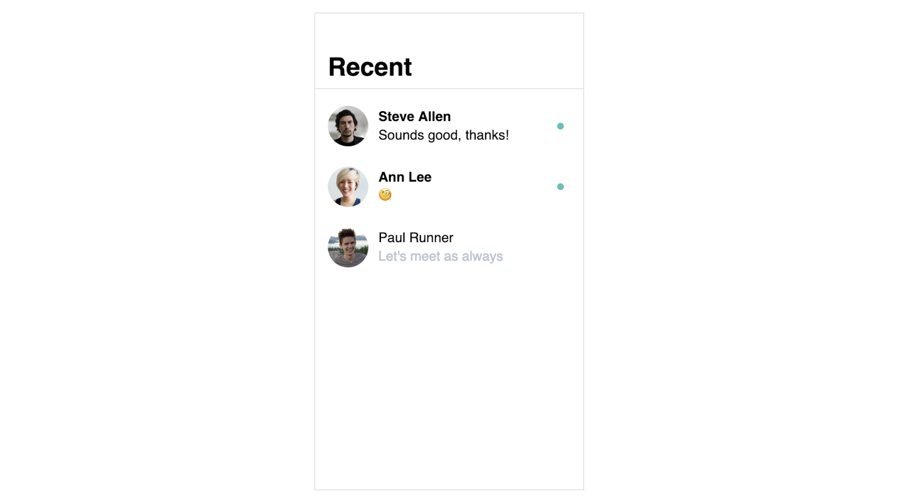

# Objects

You've created a basic list of contacts in [Lists](./lists.md) section using an array of names and a `v-for` loop. But in real-life prototyping lists are usually a little more complex. For example, in a list of recent conversation each item may contain not only a name, but also a picture, a message and unread indicator:



When you need to store an item that has multiple types of data in it, you create an **Object**. Objects are similar to arrays in a way they contain multiple variables, but unlike in arrays, variables are not given indexes, but you define **names** for them instead.

Take a look at the object that we can use for **one** of the items in our Recent conversations UI:

```js
data: {
  contact: {
    firstName: 'Steve',
    lastName: 'Allen',
    latestMessage: 'Lorem ipsum dolor sit.',
    unread: 0,
    avatar: 'http://image.com'
  }
}
```

The content of an object is place within curly braces and its items are separated by commas. Each item is a variable with a name and a value separated by colon. 

:::tip Good eye
Does this syntax look familiar? This is exactly the way **data** container you use to store all your [variables](./../Data/#variables) is build. This is not a coincidence — data container is in fact an object.
:::

<!-- Similarly to the way you use arrays' [indexes](./indexes.html#indexes) to access their items in your layout, you use names to access your objects' items: -->

To access items stored inside an object you reference the object by its name followed by a dot and followed by the name of a parameter:

```html
<div>
  {{contact.firstName}} {{contact.lastName}} 
</div>
<div>
  {{contact.latestMessage}}
</div>
```

The layout above will use `contact` object to render its parameters: `firstName` and `lastName` in the first containers, and `lastestMessage` in the second. 

## Array of objects

The task suggests we need not one but many objects. As you've learned from previous section, you to render a list, you need to store items in the array, and an a array is a list of variables of **any** type. This means if you need a list of complex items, you need an array of objects. 

This type of an array does look small in code, but doesn't introduce anything new, just a combination of what you've learnt previousely:

```js
data: {
  contacts: [
    {
      firstName: 'Steve',
      lastName: 'Allen',
      latestMessage: 'Lorem ipsum dolor sit.',
      unread: 0,
      avatar: 'http://image.com'
    },
    {
      firstName: 'Steve',
      lastName: 'Allen',
      latestMessage: 'Lorem ipsum dolor sit.',
      unread: 0,
      avatar: 'http://image.com'
    },
    {
      firstName: 'Steve',
      lastName: 'Allen',
      latestMessage: 'Lorem ipsum dolor sit.',
      unread: 0,
      avatar: 'http://image.com'
    }
  ]
}
```

...

```html
<div v-for="contact in contacts">
  <div>
    {{contact.firstName}} {{contact.lastName}} 
  </div>
  <div>
    {{contact.latestMessage}}
  </div>
</div>
```

...