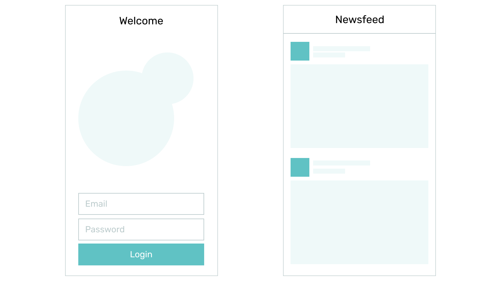
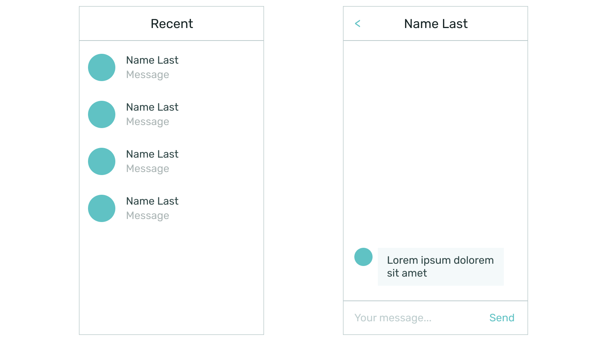

# Hiding containers

## Conditional rendering

Let's say you are creating a prototype with two views:



The task is as simple as showing the Login view if users are not authenticated, and showing the Newsfeed if they are. So you need to have both layouts in your prototype, but only one of them is shown at a time.

To make a container appear conditionally you start with creating a variable you will base your decision on. In the example above the condition is the state of authentication. It is binary — a user is either logged in or is not. This is where Boolean variables, being binary by nature, come in handy:

```js
data: {
	isUserLoggedIn: false,
}
```

Now all you have to do is to make a container conditional by adding `v-if` attribute:

```html
<div v-if="isUserLoggedIn">
	<!-- Dashboard view content -->
</div>
```

`v-if` attribute can be read as “display the container only if the following condition is true”. Since the default value for `isUserLoggedIn` is `false` the container will not be shown in a browser.

To test this, download the [file](https://firebasestorage.googleapis.com/v0/b/mockupless.appspot.com/o/conditions%2Fvif-1.html.zip?alt=media&token=78d7fa52-6c9c-46cd-bd40-e432507ff13c), open it in Chrome, and enjoy the blank screen. Now open the Vue section in Chrome developer tools, find the `isUserLoggedIn` variable, double-click on its value and change it to `true`. The word “Dashboard” should appear on the page.


### Hands-on

Open the same file in VSCode and change the name of the variable from `isUserLoggedIn` to `doShowNewsfeed` and change the default value to `true`. Test it in browser. You should see the word Dashboard on screen. If you don't, go back to code and make sure that you've changed the name of the variable in the `v-if` attribute as well.

:::tip Remember
When you change the name of the variable you have to change it everywhere in your code. In VSCode press `command + f` to open Find menu to look for instances. You can also press `command + option + f` to open Replace menu to quickly find and replace all instances.
:::

## Not

Opposite to the Dashboard's condition, the Login view is shown to *not* authenticated users. There's a special operator that allows you to check for a *not* condition. It's conveniently called **not** and it's written as an exclamation mark before the variable:

```html
<div v-if="!isUserLoggedIn">
	<!-- Login view content -->
</div>
```

The expression above can be read as "Show the container only if the following condition is *not* true". Since being false is the only way of being not true, the container will be shown when the `isUserLoggedIn` has the value of `false`.

:::tip Pro tip
Naming your Boolean variables in a form of a general question helps to quickly identify them as booleans in your code and optimize suggestions provided by VSCode. If you have many conditions defined this way inside `data` container, when you type `v-if="is` or `v-if="do` you will be presented with suggestions of all the variables you designed as conditions, so you will save time finding the right one.
:::

With both containers being conditional your layout should look similar to this:

```html
<div v-if="!isUserLoggedIn">
	<!-- Login view content -->
</div>
<div v-if="isUserLoggedIn">
	<!-- Dashboard view content -->
</div>
```

Try it yourself: download the [file](https://firebasestorage.googleapis.com/v0/b/mockupless.appspot.com/o/conditions%2Fvif-2.html.zip?alt=media&token=9f583403-aa54-406f-bae8-eac568ae478b), open it in Chrome and use  Vue devtools to change the value of the variable from `false` to `true` and back. The content you see on a page is supposed to change accordingly:


## Self-practice: basic 

Create a lo-fi prototype of a messaging app with two views — a list of chats and a chat:



1. Create a Boolean variable to use as a condition.
2. Add `v-if` to each of the two views so only one of them is shown, depending on the value of the variable.
3. Test your prototype by changing the value in Vue devtools in Chrome.

:::tip Pro tip
When you design the layout, use the power of conditional rendering to hide things you don't need at the moment. Let's say you've created the layout for List view. Now you want to create Chat view, but as soon as you start working on it and preview it in Chrome, you realize that the List view is in your way. To focus on developing the Chat view layout add `v-if` attribute to List container and make sure the variable it uses as a condition is `false`. This will hide the List container and allow you to focus on Chat layout.
:::

## Self-practice: pro

Conditional rendering is not limited to showing and hiding pages in your prototype. Quite often smaller containers *within* a view also must be hidden unless some conditions are met.

Practice this by creating a simple subscription form that initially shows only one checkbox, and it's off by default. If the user checks it, show  another 2 checkboxes, as seen on a sketch below:


1. Create a layout with all the containers and the content.
2. Create a variable and connect it to the first checkbox.
3. Use this variable as a condition for a container with other two checkboxes.
4. Test your prototype by checking and unchecking the first checkbox. The other two checkboxes should be shown and hidden as designed.