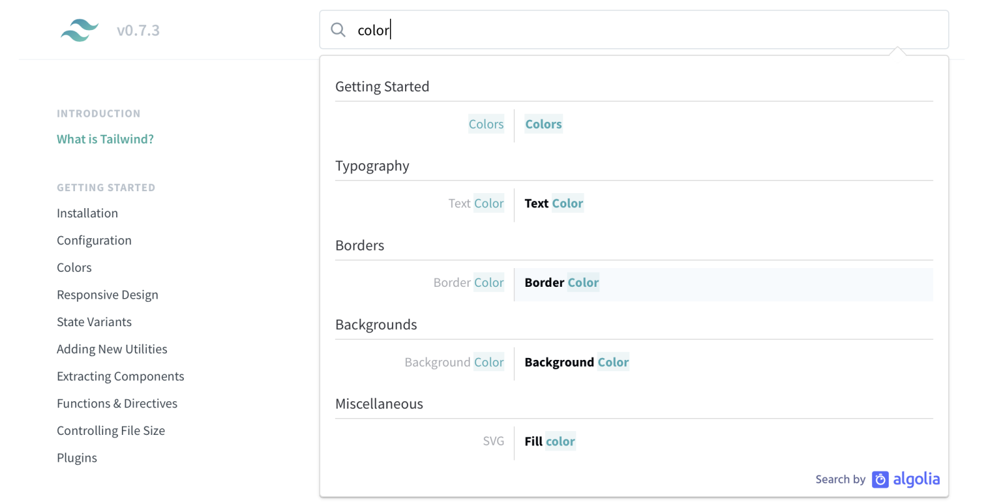
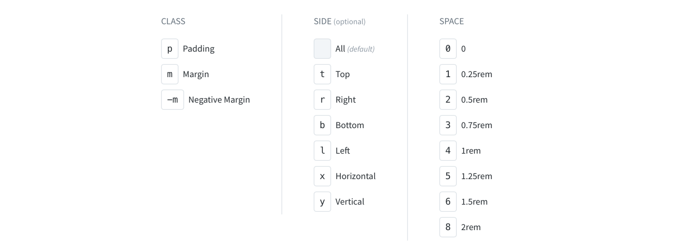

# Usage

## Install

To enable Tailwind in your prototypes you need to include a link to Tailwind's stylesheet in your `<head>` container:

```html
<head>
  <!-- prototype meta  -->
  <link href="https://cdn.jsdelivr.net/npm/tailwindcss/dist/tailwind.min.css" rel="stylesheet">
</head>
```

With this line in place you are able to apply Tailwind classes to your prototype:

```html
<button class="px-6 py-3 rounded text-white bg-teal hover:bg-teal-dark">
  Confirm
</button>
```


## Learn by practice

It takes time to learn Tailwind names of CSS properties. <!--In the course's following articles you will become familiar with the way Tailwind works with CSS you've learnt so far. However,--> The most complete and up-to-date reference is [Tailwind's official documentation](https://tailwindcss.com/docs/what-is-tailwind). Its navigation on the left has a very nice structure, but you will probably find yourself using search most of the time, because it's way faster to navigate with it:



## Core concepts

#### Color

Tailwind comes with a nice [default color palette](https://tailwindcss.com/docs/colors) of colors and shades that are used for [text color](https://tailwindcss.com/docs/text-color), [background color](https://tailwindcss.com/docs/background-color) and [border color](https://tailwindcss.com/docs/border-color).


To apply a color, you specify one from the palette and optionally a shade:

```html
<div class="text-teal"></div>
<div class="bg-pink-darker"></div>
<div class="border border-yellow-light"></div>
```

#### Combination tables

Some styles like [border width](https://tailwindcss.com/docs/border-width) and [padding and margin](https://tailwindcss.com/docs/spacing) are presented as multi-column tables:



This means that you a variety of options for what and you want to stylize. You start with picking a class from the first column, a side from the second one and space from the last one to be as specific as you want:

```html
<div class="p-2"></div> 
<div class="mx-3"></div>
<div class="pt-1 px-6 pb-2"></div>
```

Notice that some columns are optional (like Side above), which means you can skip it and the default value will be applied.

## Restraints

Tailwind is so much more than just a library of classes <!--, but that's what our way of using it is limited too-->. You may find very exiting advanced features in Tailwind's documentation such as [configuration](https://tailwindcss.com/docs/configuration) that allows you to customize default classes and create your own, and the ability to add [new utilities](https://tailwindcss.com/docs/adding-new-utilities).

Unfortunally, those are not avalailable when using Tailwind in flat html file. However you can still overwrite the Tailwind classes and create your own by writing them in `<style>` container inside the `<head>` of your prototype:

```html
<head>
  <!-- prototype meta  -->
  <link href="https://cdn.jsdelivr.net/npm/tailwindcss/dist/tailwind.min.css" rel="stylesheet">
  <style>
    .px-4 {
      padding-left: 1.1rem;
      padding-right: 1.1rem;
    }
  </style>
</head>
```

You have to make sure though, that your `<style>` container is below Tailwind's `<link>`, so it has higher priority.